# DOCKER SERVICE MOUNT

Disusun Oleh:

Nama : Rizal Maulana Airlangga

Kelas : 2 S.Tr. Teknik Informatika B

NRP : 3124600033

Kelompok : B4

Modul : 2 (dua)

**Dosen Pengampu:**

Dr. Ferry Astika Saputra, S.T., M.Sc.

**PROGRAM STUDI D4 TEKNIK INFORMATIKA**

**DEPARTEMEN TEKNIK INFORMATIKA DAN KOMPUTER**

**POLITEKNIK ELEKTRONIKA NEGERI SURABAYA**

2026\
=====

# Jawaban Pre-Lab

1.  Apa perbedaan default bridge dan user-defined bridge network?

> Default bridge dibuat otomatis oleh Docker tetapi tidak mendukung DNS
> antar container. User-defined bridge dibuat manual dan mendukung
> komunikasi antar container menggunakan nama container.

2.  Kapan menggunakan Volume vs Bind Mount vs tmpfs?

> Volume digunakan untuk data persisten production. Bind mount digunakan
> saat development agar file host langsung sinkron dengan container.
> tmpfs digunakan untuk data sementara di memory yang tidak perlu
> disimpan ke disk.

3.  Apa yang terjadi pada named volume saat docker compose down?
    Bagaimana jika pakai flag -v?

> docker compose down tidak menghapus named volume sehingga data tetap
> ada. Jika menggunakan flag -v, maka volume ikut dihapus dan data
> hilang.

4.  Apa fungsi depends_on dan healthcheck di docker-compose.yml?

> depends_on mengatur urutan startup service. healthcheck digunakan
> untuk memeriksa apakah service benar-benar siap digunakan.

5.  Mengapa user-defined bridge bisa DNS resolve nama container,
    sedangkan default bridge tidak?

> Karena user-defined bridge memiliki embedded DNS server Docker
> sehingga container dapat saling mengenali menggunakan nama container.

\
=

# Screenshot Wajib

## docker network ls

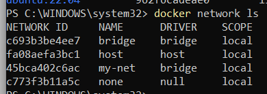

## ping antar Container by Nama

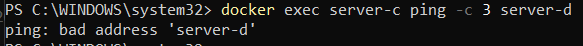

Agar berhasil, buat network, lalu jalankan ulang container di network
tersebut

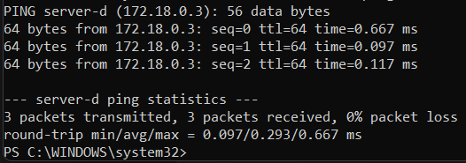

## docker volume ls + inspect

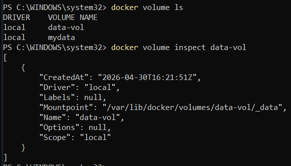

## Volume Sharing antar Container

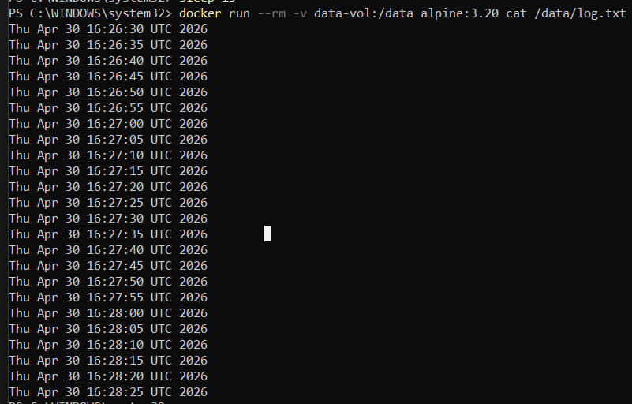

## Bind Mount Live-Reload (Sebelum atau Sesudah Edit)

Sebelum edit

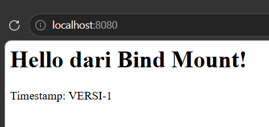

Setelah edit

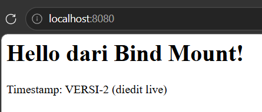

## tmpfs inspect 

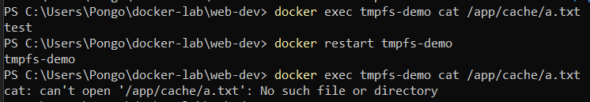

## docker compose ps

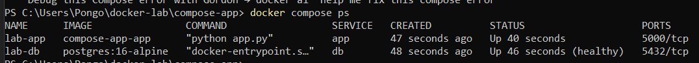

## Browser Halaman Web 

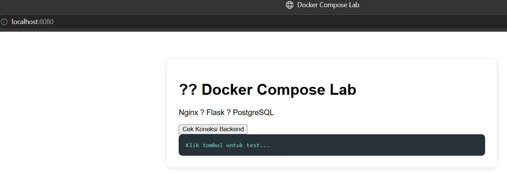

## curl /api/health Response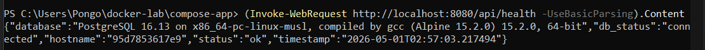

## docker compose down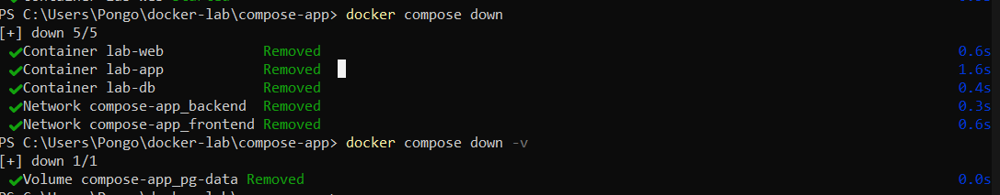

\
=

# Pertanyaan Post-Lab

1.  Jalankan docker network inspect lab-frontend. Sebutkan container dan
    IP masing-masing.

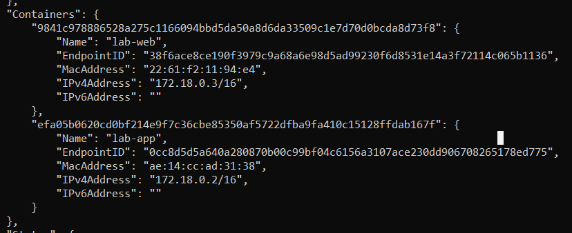

1.  Container yang terhubung pada network compose-app_frontend adalah:

    1.  lab-web = IP: 172.18.0.3/16

    2.  lab-app = IP: 172.18.0.2/16

2.  Container lab-db tidak termasuk karena hanya berada pada network
    compose-app_backend

<!-- -->

2.  Hapus container lab-app lalu docker compose up -d lagi. Apakah data
    PostgreSQL masih ada? Mengapa?

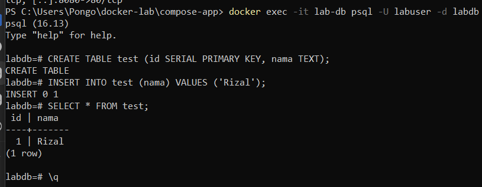

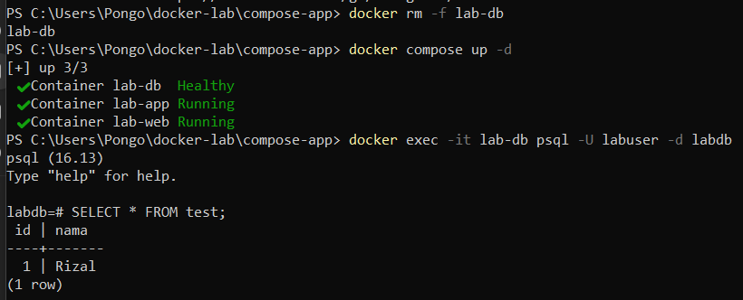

1.  Data masih ada

2.  Karena data database tidak disimpan di dalam container, melainkan
    pada Docker Volume (pg-data) yang didefinisikan pada
    docker-compose.yml. Sehingga data tidak ikut terhapus saat container
    dihapus dan masih bisa digunakan kembali saat container baru dibuat

<!-- -->

3.  Tunjukkan perbedaan output docker inspect untuk mount type volume vs
    bind.

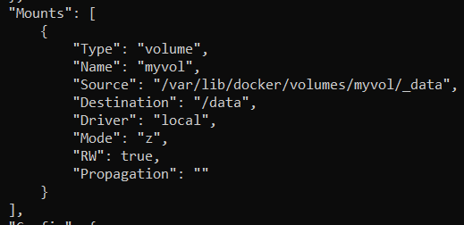

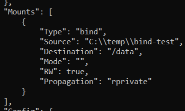

| Aspek         | Volume                               | Bind Mount          |
|---------------|--------------------------------------|---------------------|
| Type          | "volume"                             | "bind"              |
| Source        | /var/lib/docker/volumes/myvol/\_data | C:\\temp\\bind-test |
| Name          | ada (myvol)                          | tidak ada           |
| Dikelola oleh | Docker                               | User (host OS)      |

4.  Jelaskan alur request dari browser → nginx → Flask → PostgreSQL.

    1.  Browser → Nginx

        1.  User membuka: http://localhost:8080

        2.  Request masuk ke container: lab-web (Nginx) dan Port
            mapping: 8080 → 80

    2.  Nginx → Flask (Reverse Proxy)

        1.  Di nginx.conf:

> location /api/ { proxy_pass http://app:5000; }

2.  Artinya: request /api/... diteruskan ke http://app:5000

3.  app = nama container Flask (DNS Docker)

<!-- -->

3.  Flask → PostgreSQL

    1.  Di app.py:

> conn = psycopg2.connect( host="db", dbname="labdb", user="labuser",
> password="labpass123" )

2.  Flask connect ke: db (container PostgreSQL)

3.  Query: SELECT version();

<!-- -->

4.  Response balik

    1.  PostgreSQL → Flask → Nginx → Browser

    2.  Output JSON:

> { "status": "ok", "db_status": "connected" }

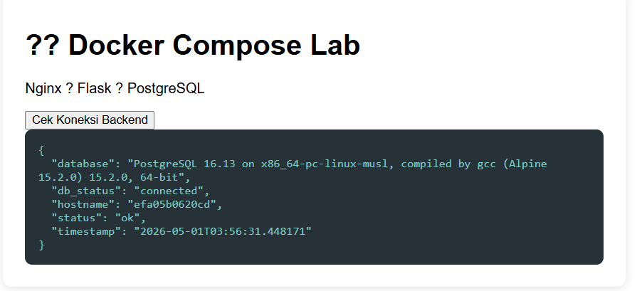

5.  Bandingkan ukuran image yang digunakan stack ini. Mana terbesar dan
    mengapa?

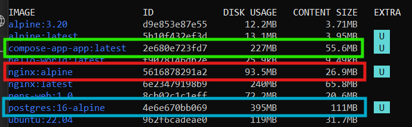

| Image                          | Size    |
|--------------------------------|---------|
| compose-app-app:latest (Flask) | 227 MB  |
| nginx:alpine                   | 93.5 MB |
| postgres:16-alpine             | 395 MB  |

1.  Terbesar: postgres:16-alpine (395 MB)

    1.  Database engine lengkap (PostgreSQL)

    2.  Berisi: query engine, storage engine, indexing dan replication
        tools

2.  Flask app (compose-app-app) (227 MB)

    1.  Base image: Python (python:3.11-slim)

    2.  Tambahan: Flask dan psycopg2

    3.  layer build dari Dockerfile

3.  nginx:alpine (93.5 MB)

    1.  Hanya web server

    2.  tidak ada runtime besar

    3.  minimal dependency
