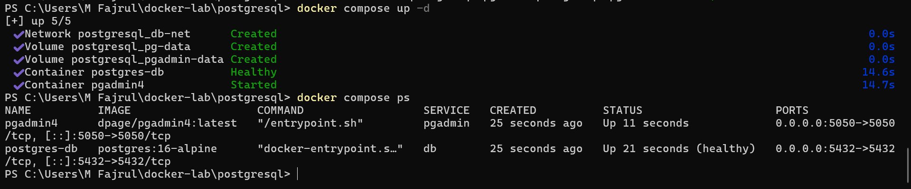
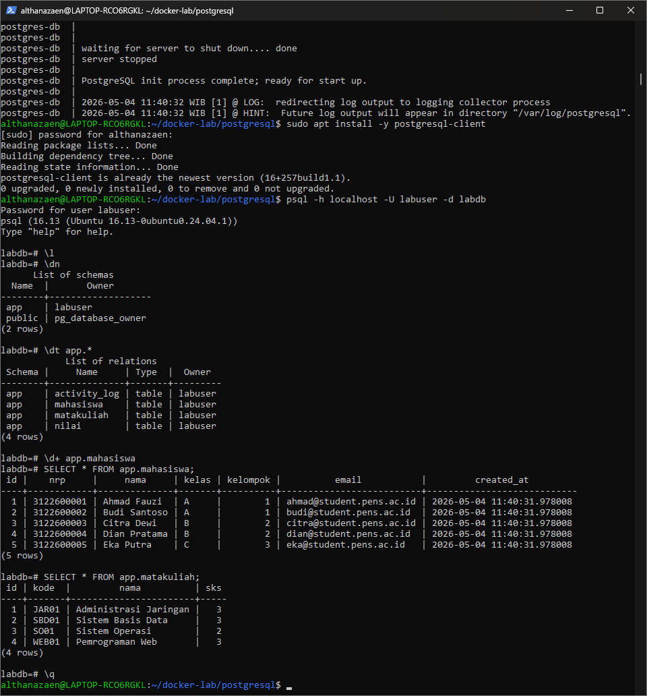
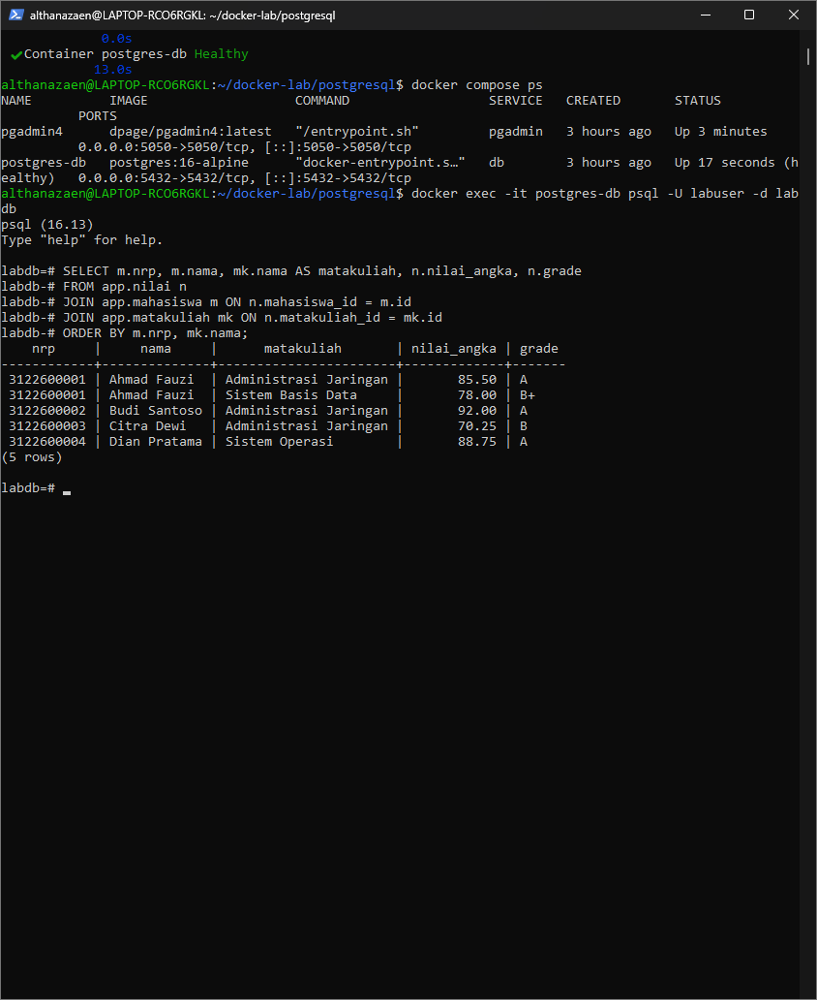
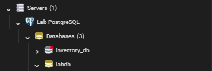
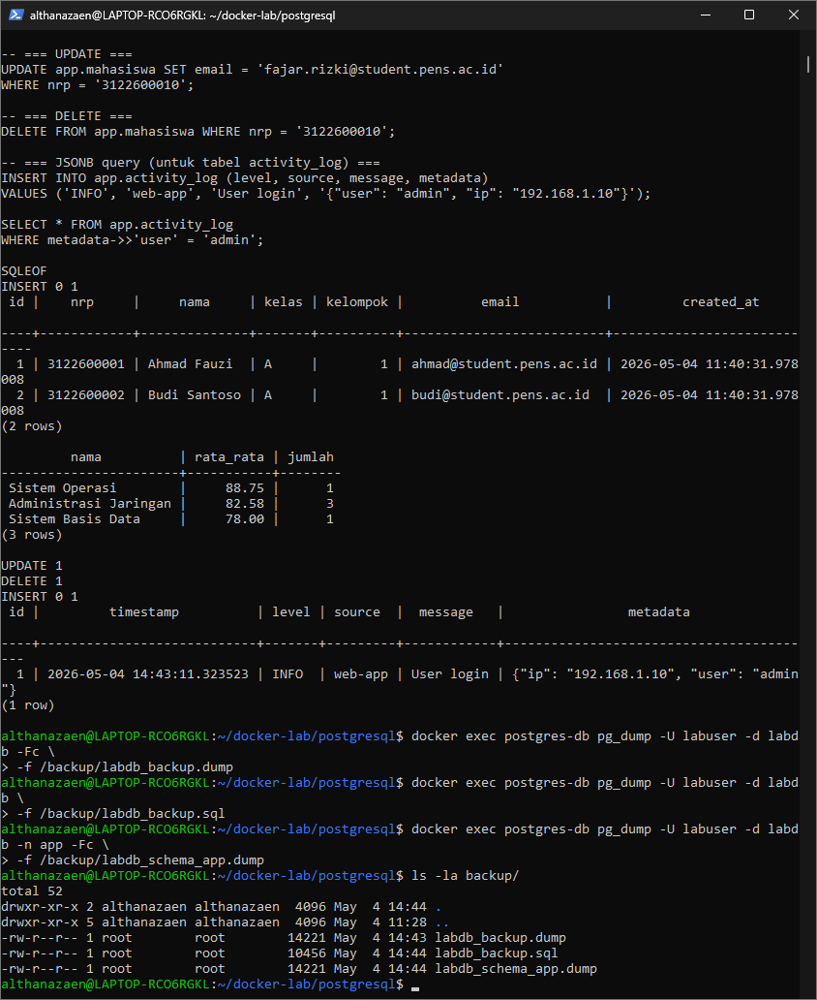
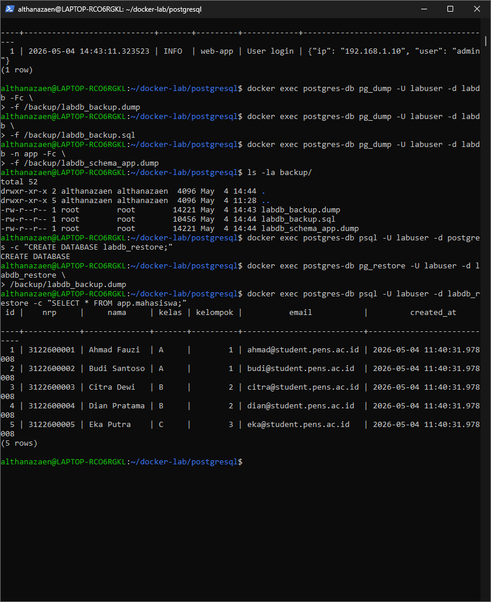
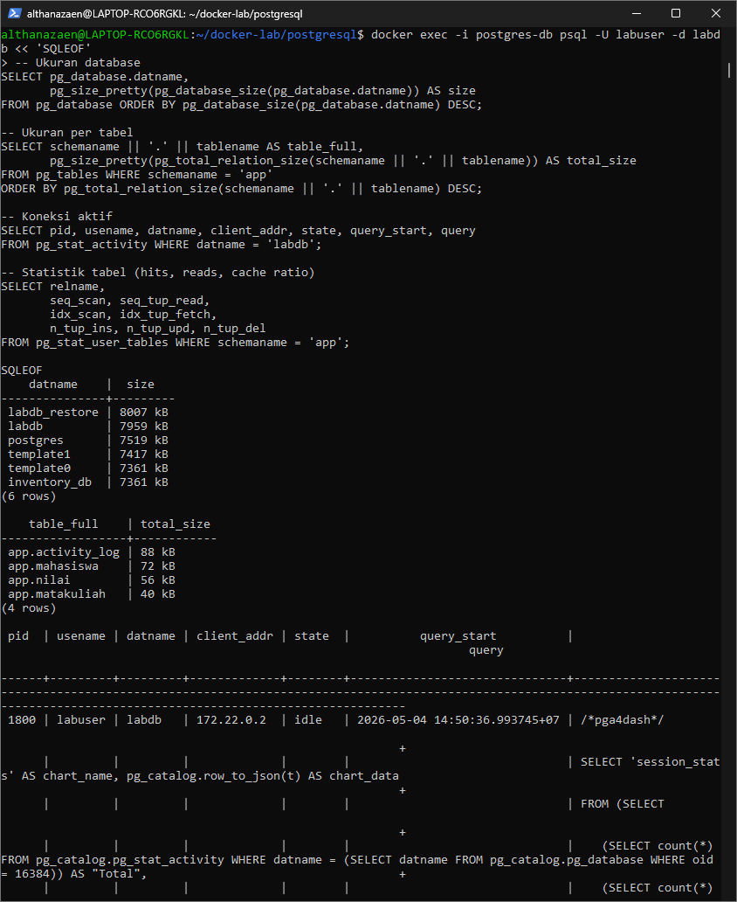
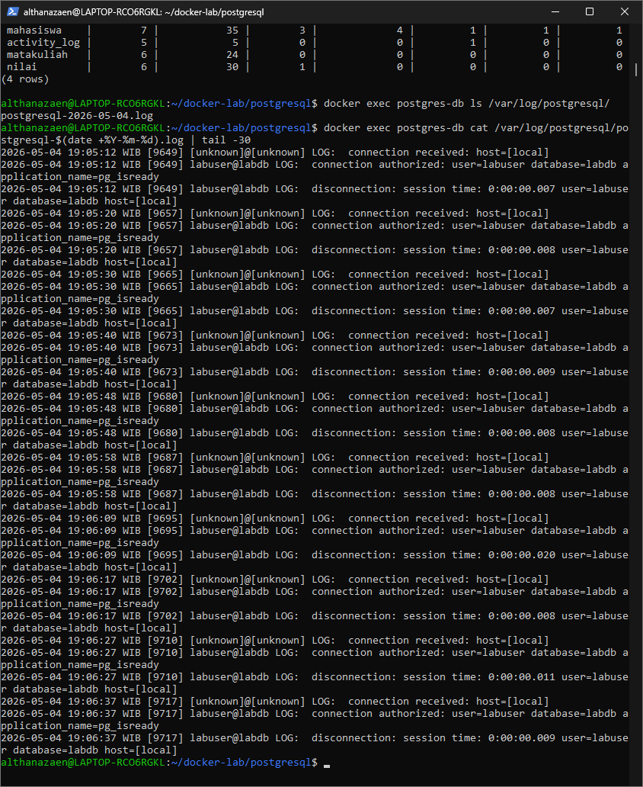

**DATABASE POSTGRESQL**

Disusun Oleh:

Nama : Rizal Maulana Airlangga

Kelas : 2 S.Tr. Teknik Informatika B

NRP : 3124600033

Kelompok : B4

Modul : 4 (empat)

**Dosen Pengampu:**

Dr. Ferry Astika Saputra, S.T., M.Sc.

**PROGRAM STUDI D4 TEKNIK INFORMATIKA**

**DEPARTEMEN TEKNIK INFORMATIKA DAN KOMPUTER**

**POLITEKNIK ELEKTRONIKA NEGERI SURABAYA**

**2026**

**Jawaban Pre-Lab**

1.  Apa fungsi file/folder /docker-entrypoint-initdb.d/ di image
    PostgreSQL?

> Folder tersebut digunakan untuk menjalankan script SQL atau shell
> otomatis saat PostgreSQL pertama kali dibuat.

2.  Mengapa POSTGRES_PASSWORD wajib diset? Apa risikonya jika tidak ada
    password?

> Password wajib diset untuk keamanan akses database. Tanpa password,
> database rentan diakses pihak tidak berwenang.

3.  Jelaskan perbedaan antara pg_dump format custom (-Fc) dan format SQL
    plain text.

> Format custom bersifat binary, mendukung kompresi dan restore
> selektif. SQL plain text menghasilkan file SQL biasa yang dapat dibaca
> manusia.

4.  Apa itu shared_buffers dan mengapa perlu disesuaikan untuk
    container?

> shared_buffers adalah memory cache PostgreSQL untuk menyimpan data
> yang sering diakses. Nilainya perlu disesuaikan agar penggunaan RAM
> container tidak berlebihan.

5.  Mengapa data PostgreSQL harus disimpan di Docker Volume, bukan di
    container layer?

> Karena container bersifat ephemeral. Jika container dihapus, data di
> layer container akan hilang, sedangkan volume bersifat persisten.

# Screenshot Wajib

1.  docker compose ps — db dan pgadmin running + healthy
    

2.  psql connect + \dt app.\* — list tabel 

3.  SELECT \* FROM app.mahasiswa — data sample

4.  Query JOIN nilai — output tabel gabungan

5.  pgAdmin4 login + server connection

6.  pgAdmin4 — tabel view/edit data

7.  pg_dump output — backup file terbuat

8.  pg_restore + SELECT — data berhasil di-restore

9.  pg_stat_activity — koneksi aktif

10. PostgreSQL log — isi log file

**Pertanyaan Post-Lab**

1.  Jalankan docker compose down lalu docker compose up -d. Apakah data
    mahasiswa masih ada? Buktikan.

> **Data mahasiswa masih ada**
>
> Perintah docker compose down secara default hanya menghapus container
> dan network, tetapi **tidak menghapus Docker Volume** yang
> didefinisikan di docker-compose.yml. Volume pg-data yang menyimpan
> data PostgreSQL (/var/lib/postgresql/data) tetap tersimpan di host.
>
> Langkah pembuktian:

1)  Jalankan docker compose down

2)  Jalankan docker compose up -d

3)  Koneksi ke database dengan docker exec -it postgres-db psql -U
    labuser -d labdb

4)  Jalankan query: SELECT \* FROM app.mahasiswa;

5)  Hasil: data mahasiswa (Ahmad Fauzi, Budi Santoso, Citra Dewi, dll.)
    masih ditampilkan lengkap

> Hal ini terjadi karena volume pg-data bertipe named volume yang
> managed oleh Docker dan persist di
> /var/lib/docker/volumes/pg-data/\_data di host filesystem.

2.  Jalankan docker compose down -v lalu docker compose up -d. Apa yang
    terjadi? Apakah init script dijalankan ulang?

> **Data akan hilang dan init script dijalankan ulang.**
>
> Perintah docker compose down -v menghapus container, network, **dan
> semua named volume** yang didefinisikan di docker-compose.yml
> (termasuk pg-data, pg-logs, dan pgadmin-data).
>
> Ketika docker compose up -d dijalankan kembali:

- Volume pg-data dibuat baru (kosong)

- Container PostgreSQL mendeteksi bahwa data directory masih kosong

- Entrypoint script menjalankan initdb untuk inisialisasi database baru

- Semua file .sql dan .sh di /docker-entrypoint-initdb.d/ dieksekusi
  ulang

- Schema app, tabel mahasiswa, matakuliah, nilai, activity_log dibuat
  kembali

- Data sample di-insert kembali ke tabel

> Init script dijalankan ulang karena kondisi inisialisasi (PGDATA
> kosong) terpenuhi. Ini merupakan perilaku yang diharapkan dan sangat
> berguna untuk environment development dan testing.

3.  Bandingkan ukuran file backup format custom vs SQL. Mana yang lebih
    kecil dan mengapa?

> **Format custom (-Fc) lebih kecil daripada format SQL plain text.**

1)  **Kompresi bawaan:** Format custom menggunakan algoritma kompresi
    internal PostgreSQL yang mengkompresi data sebelum disimpan ke disk.
    Format SQL plain text tidak memiliki kompresi bawaan.

2)  **Format binary:** Format custom menyimpan data dalam representasi
    binary yang lebih efisien daripada teks. Misalnya, integer disimpan
    sebagai 4 byte binary, bukan sebagai string karakter.

3)  **Tanpa statement SQL:** Format SQL plain text berisi perintah SQL
    lengkap (CREATE TABLE, INSERT INTO, dll.) yang memerlukan banyak
    karakter teks. Format custom hanya menyimpan data mentah tanpa
    sintaks SQL.

4)  **Metadata terpisah:** Format custom memisahkan metadata (schema
    definition) dari data, sehingga tidak ada redundansi. Format SQL
    mengulang informasi tipe data di setiap baris INSERT.

<!-- -->

4.  Buat query yang menampilkan mahasiswa yang belum memiliki nilai di
    semester apapun.

> SELECT m.id, m.nrp, m.nama, m.kelas, m.kelompok
>
> FROM app.mahasiswa m
>
> LEFT JOIN app.nilai n ON m.id = n.mahasiswa_id
>
> WHERE n.mahasiswa_id IS NULL;

5.  Jelaskan peran user app_reader yang dibuat di init script. Apa
    bedanya dengan labuser?

<table style="width:98%;">
<colgroup>
<col style="width: 25%" />
<col style="width: 34%" />
<col style="width: 37%" />
</colgroup>
<thead>
<tr>
<th><blockquote>

<strong>Aspek</strong>

</blockquote></th>
<th><blockquote>

<strong>labuser</strong>

</blockquote></th>
<th><blockquote>

<strong>app_reader</strong>

</blockquote></th>
</tr>
<tr>
<th><blockquote>

<strong>Tipe user</strong>

</blockquote></th>
<th><blockquote>

Superuser / Owner database

</blockquote></th>
<th><blockquote>

Regular user dengan hak terbatas

</blockquote></th>
</tr>
<tr>
<th><blockquote>

<strong>Dibuat oleh</strong>

</blockquote></th>
<th><blockquote>

Environment variable POSTGRES_USER

</blockquote></th>
<th><blockquote>

Init script (CREATE USER)

</blockquote></th>
</tr>
<tr>
<th><blockquote>

<strong>Hak akses schema</strong>

</blockquote></th>
<th><blockquote>

Full access ke semua schema

</blockquote></th>
<th><blockquote>

Hanya USAGE pada schema app

</blockquote></th>
</tr>
<tr>
<th><blockquote>

<strong>Hak akses tabel</strong>

</blockquote></th>
<th><blockquote>

Full CRUD (CREATE, READ, UPDATE, DELETE)

</blockquote></th>
<th><blockquote>

Hanya SELECT (read-only)

</blockquote></th>
</tr>
<tr>
<th><blockquote>

<strong>Tujuan</strong>

</blockquote></th>
<th><blockquote>

Administrasi database, development, deployment

</blockquote></th>
<th><blockquote>

Aplikasi production yang hanya membaca data

</blockquote></th>
</tr>
<tr>
<th><blockquote>

<strong>Keamanan</strong>

</blockquote></th>
<th><blockquote>

Berisiko tinggi jika credential bocor

</blockquote></th>
<th><blockquote>

Berisiko rendah — tidak bisa menghapus atau mengubah data

</blockquote></th>
</tr>
</thead>
<tbody>
</tbody>
</table>
