**LOGGING SERVICE**

Disusun Oleh:

Nama : Rizal Maulana Airlangga

Kelas : 2 S.Tr. Teknik Informatika B

NRP : 3124600033

Kelompok : B4

Modul : 5 (lima)

**Dosen Pengampu:**

Dr. Ferry Astika Saputra, S.T., M.Sc.

**PROGRAM STUDI D4 TEKNIK INFORMATIKA**

**DEPARTEMEN TEKNIK INFORMATIKA DAN KOMPUTER**

**POLITEKNIK ELEKTRONIKA NEGERI SURABAYA**

**2026**

**Jawaban Pre-Lab**

1.  Mengapa centralized logging penting di lingkungan container?

> Karena log dari banyak container dapat dikumpulkan di satu tempat
> sehingga mempermudah monitoring, troubleshooting, dan audit.

2.  Apa perbedaan antara Docker logging driver json-file dan fluentd?

> json-file menyimpan log lokal di host dalam format JSON. fluentd
> mengirim log langsung ke log collector seperti Fluent Bit atau
> Fluentd.

3.  Jelaskan keuntungan menyimpan log di database vs file text.

> Database mendukung query, indexing, filtering, dan analisis data lebih
> mudah dibanding file text biasa.

4.  Apa itu structured logging dan mengapa lebih baik daripada plain
    text log?

> Structured logging menggunakan format terstruktur seperti JSON
> sehingga mudah diparsing, dicari, dan dianalisis secara otomatis.

5.  Mengapa Fluent Bit lebih cocok untuk sidecar/edge collection
    dibanding Fluentd?

> Karena Fluent Bit lebih ringan, menggunakan memory kecil, dan memiliki
> performa tinggi sehingga cocok dijalankan dekat aplikasi/container.

**Screenshot Wajib**

1.  docker compose ps — 5 service running 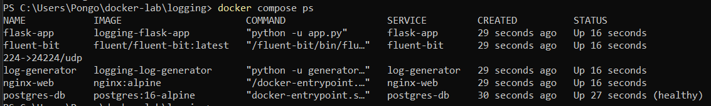

2.  docker compose logs fluent-bit — Fluent Bit menerima log

> 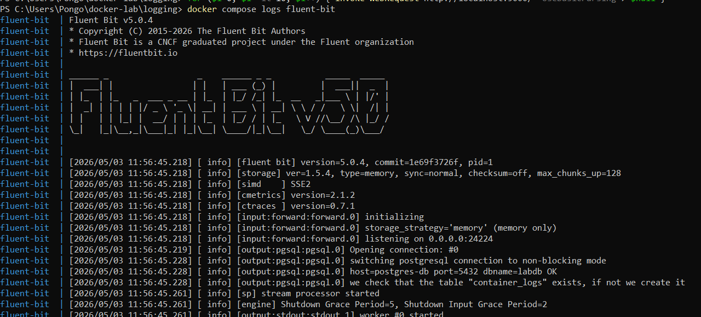 style="width:8.21756in;height:3.71522in" />

3.  SELECT COUNT(\*) FROM logs.container_logs — jumlah total log

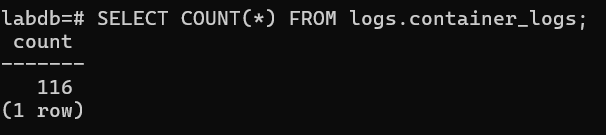

4.  SELECT \* FROM logs.recent_logs LIMIT 10 — sample log terbaru
    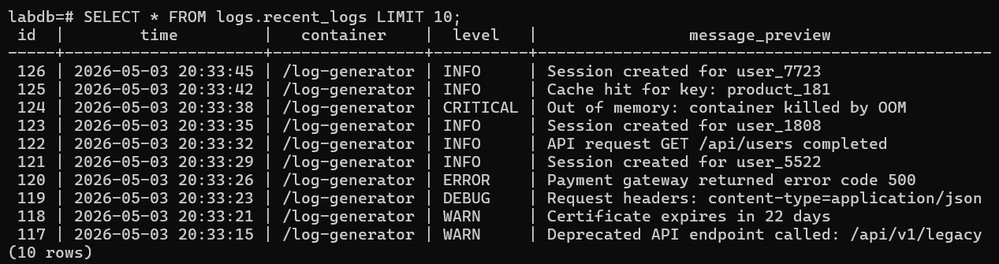

5.  Query distribusi per container — output tabel

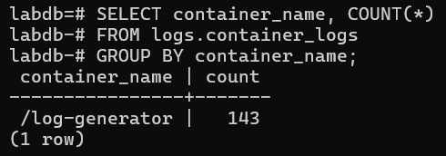

6.  Query distribusi per level — output tabel

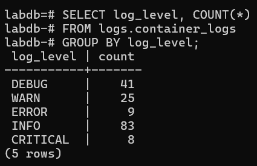

7.  SELECT \* FROM logs.error_summary — summary error

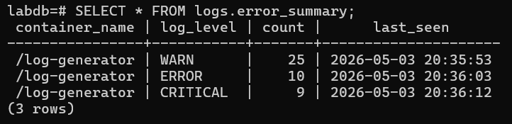

8.  Query log rate per menit — output tabel

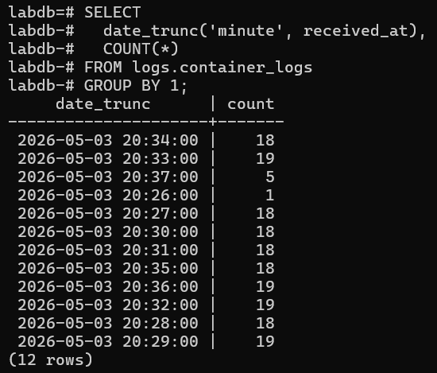

9.  curl /api/logs/stats — response JSON

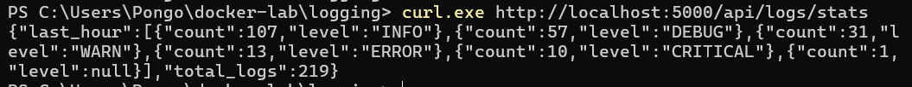

10. curl /api/logs/search?q=error — response
    JSON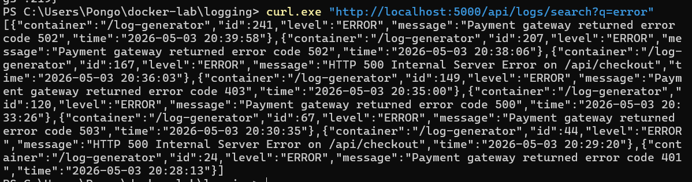

# 

# Pertanyaan Post-Lab

1.  Berapa total log yang masuk ke PostgreSQL setelah 5 menit? Tunjukkan
    distribusi per container dan per level.

> 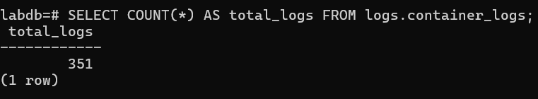 style="width:4.71994in;height:0.87628in" />
>
> total log yang masuk adalah 351 log

distribusi per container dan per level

> 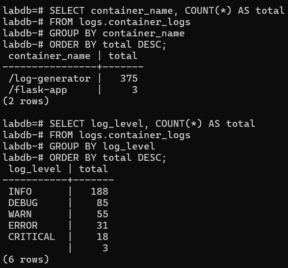 style="width:4.14702in;height:2.97813in" />

2.  Tulis query SQL yang menampilkan log rate per menit selama 10 menit
    terakhir.

> 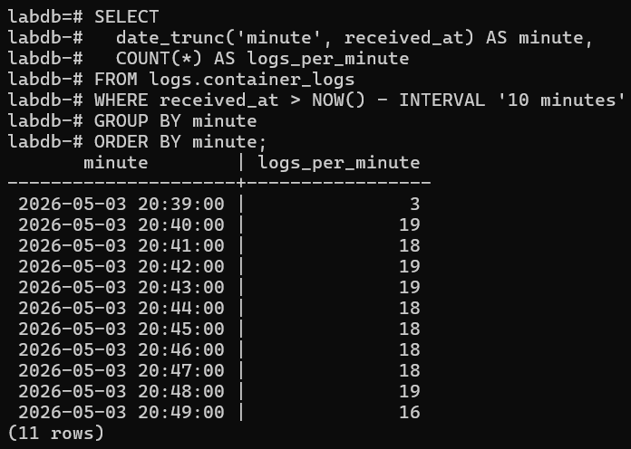 style="width:4.77202in;height:3.39579in" />

3.  Apa yang terjadi jika container fluent-bit di-stop? Apakah container
    lain juga stop? Apakah log hilang?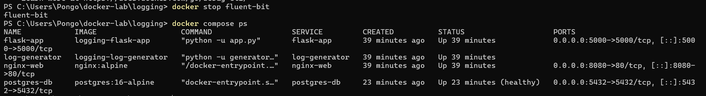

- Container lain tidak ikut stop

- Log tidak masuk ke PostgreSQL

- Log bisa:

  - tertahan (buffer)

  - atau hilang

4.  Jelaskan alur sebuah log entry dari log-generator stdout sampai
    masuk ke tabel container_logs.

log-generator (stdout JSON)

↓

Docker logging driver (fluentd)

↓

Fluent Bit (port 24224)

↓

Parsing + filter

↓

Output plugin pgsql

↓

PostgreSQL (logs.container_logs)

### Penjelasan:

1)  Python generator, print JSON ke stdout

2)  Docker tangkap log via logging driver

3)  Dikirim ke Fluent Bit

4)  Fluent Bit parsing + transform

5)  Insert ke PostgreSQL

<!-- -->

5.  Modifikasi LOG_INTERVAL menjadi 0.5 detik. Berapa log rate per menit
    yang dihasilkan?

> 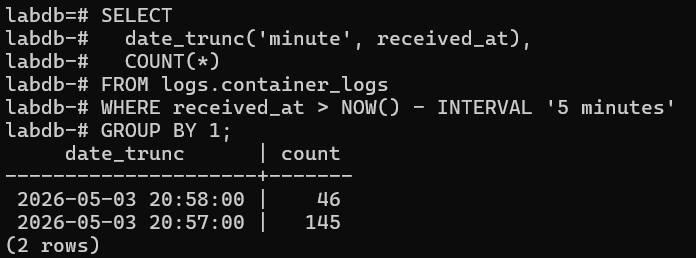 style="width:4.68869in;height:1.74095in" />
>
> Jumlah log yang masuk ke PostgreSQL dalam interval waktu 5 menit
> terakhir menunjukkan pada menit **20:57** terdapat **145** log,
> sedangkan pada menit **20:58** terdapat **46** log (belum mencapai
> satu menit penuh). Hal ini menunjukkan bahwa rata-rata log rate yang
> dihasilkan adalah sekitar **145** log per menit.
