**LOGGING SERVICE V2**

Disusun Oleh:

Nama : Rizal Maulana Airlangga

Kelas : 2 S.Tr. Teknik Informatika B

NRP : 3124600033

Kelompok : B4

Modul : 5 (lima) - Versi: 2

**Dosen Pengampu:**

Dr. Ferry Astika Saputra, S.T., M.Sc.

**PROGRAM STUDI D4 TEKNIK INFORMATIKA**

**DEPARTEMEN TEKNIK INFORMATIKA DAN KOMPUTER**

**POLITEKNIK ELEKTRONIKA NEGERI SURABAYA**

**2026**

**Jawaban Pre-Lab**

1.  Mengapa centralized logging penting di lingkungan container?

> Centralized logging penting karena pada lingkungan container log
> dihasilkan oleh banyak container yang berjalan secara terpisah dan
> dapat dibuat atau dihapus secara dinamis (ephemeral). Jika log hanya
> disimpan di masing-masing container, proses debugging, monitoring, dan
> audit menjadi sulit dilakukan. Dengan centralized logging, seluruh log
> dikumpulkan ke satu lokasi sehingga administrator dapat mencari,
> menganalisis, dan memantau aktivitas sistem dengan lebih mudah. Selain
> itu, log tidak hilang ketika container dihapus atau dibuat ulang.

2.  Apa perbedaan antara Docker logging driver json-file dan fluentd?

| **Aspek** | **json-file** | **fluentd** |
|----|----|----|
| Fungsi | Menyimpan log ke file JSON di host | Mengirim log ke Fluentd atau Fluent Bit |
| Lokasi log | Lokal pada host Docker | Server/collector log terpusat |
| Default Docker | Ya | Tidak |
| Centralized Logging | Tidak | Ya |
| Analisis log | Harus membaca file log | Dapat diteruskan ke database atau sistem monitoring |

> Driver json-file cocok untuk penggunaan sederhana karena log disimpan
> dalam file JSON lokal. Sebaliknya, driver fluentd digunakan untuk
> centralized logging karena log langsung dikirim ke Fluent Bit atau
> Fluentd untuk diproses dan disimpan secara terpusat.

3.  Jelaskan keuntungan menyimpan log di database (PostgreSQL) vs file
    text.

    1.  Mudah dicari menggunakan SQL, misalnya mencari log ERROR atau
        log dalam rentang waktu tertentu.

    2.  Mendukung indexing, sehingga pencarian lebih cepat dibanding
        membaca file satu per satu.

    3.  Dapat dianalisis dan dibuat statistik, seperti jumlah ERROR per
        jam atau distribusi log per container.

    4.  Mendukung JSONB, sehingga data log yang kompleks dapat disimpan
        dan di-query dengan mudah.

    5.  Lebih mudah diintegrasikan dengan dashboard dan aplikasi
        monitoring.

> Sedangkan file text lebih sederhana tetapi sulit untuk pencarian,
> agregasi, dan analisis ketika jumlah log sangat besar.

4.  Apa itu structured logging (JSON) dan mengapa lebih baik daripada
    plain text log?

> Structured logging adalah metode pencatatan log dalam format
> terstruktur, biasanya JSON, sehingga setiap informasi disimpan dalam
> pasangan key-value.
>
> Structured logging lebih baik karena:

- Mudah diparsing oleh aplikasi dan sistem monitoring.

- Setiap field dapat diakses secara langsung.

- Mendukung filtering berdasarkan level, service, atau timestamp.

- Cocok untuk penyimpanan JSONB di PostgreSQL.

- Memudahkan analisis otomatis dan visualisasi data.

> Plain text lebih mudah dibaca manusia, tetapi lebih sulit diproses
> secara otomatis.

5.  Mengapa Fluent Bit lebih cocok untuk sidecar/edge collection
    dibanding Fluentd?

> Fluent Bit lebih cocok digunakan sebagai sidecar atau edge collector
> karena memiliki konsumsi resource yang sangat kecil dibanding Fluentd.
>
> Perbandingan:

| **Aspek** | **Fluent Bit**          | **Fluentd**                        |
|-----------|-------------------------|------------------------------------|
| Bahasa    | C                       | Ruby + C                           |
| Memory    | ±1 MB                   | ±40 MB                             |
| Ukuran    | Ringan                  | Lebih besar                        |
| Use Case  | Edge collector, sidecar | Aggregator dan forwarder           |
| Performa  | Sangat ringan           | Lebih fleksibel tetapi lebih berat |

**Modul 5: Logging Service**

# docker compose ps — 5 service running 
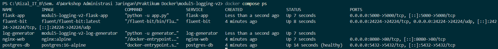

# docker compose logs fluent-bit — Fluent Bit menerima log (JSON lines di stdout) 
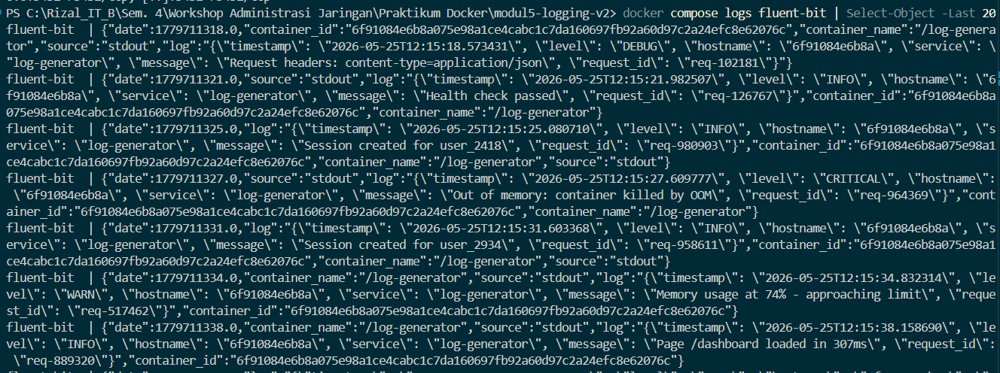

# 

# SELECT COUNT(\*) FROM logs.fluentbit — jumlah total log \> 0 

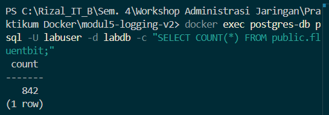

# SELECT tag, time, data FROM logs.fluentbit LIMIT 3 — raw 3-kolom data 
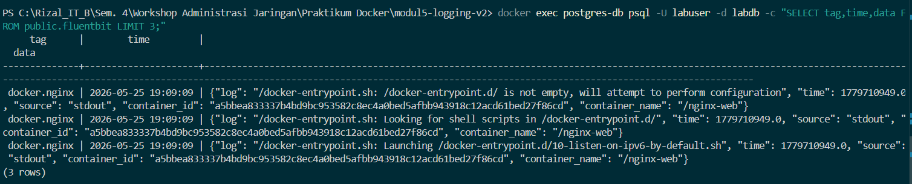

# SELECT \* FROM logs.recent_logs LIMIT 10 — log terbaru via view 
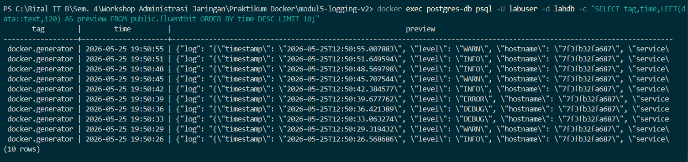

# SELECT \* FROM logs.structured_logs LIMIT 10 — parsed JSON log 
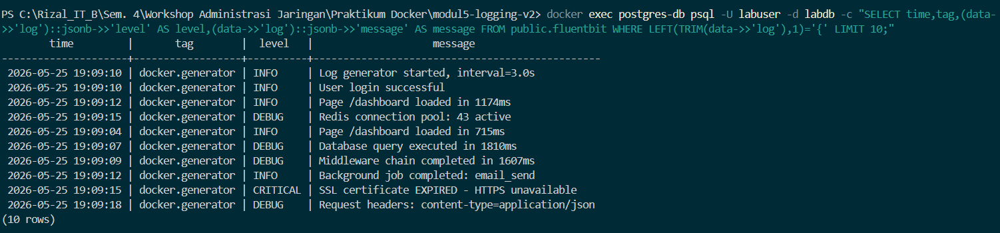

# Query distribusi per tag — output tabel 
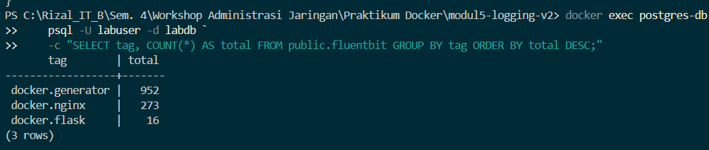

# Query distribusi per level — output tabel 

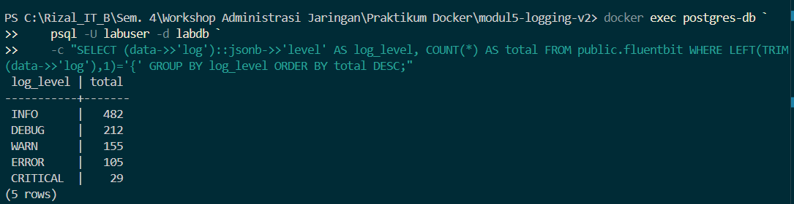

# SELECT \* FROM logs.error_summary — summary error 
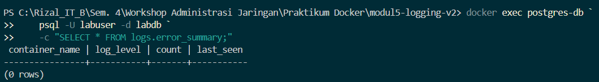

# Query log rate per menit — output tabel 
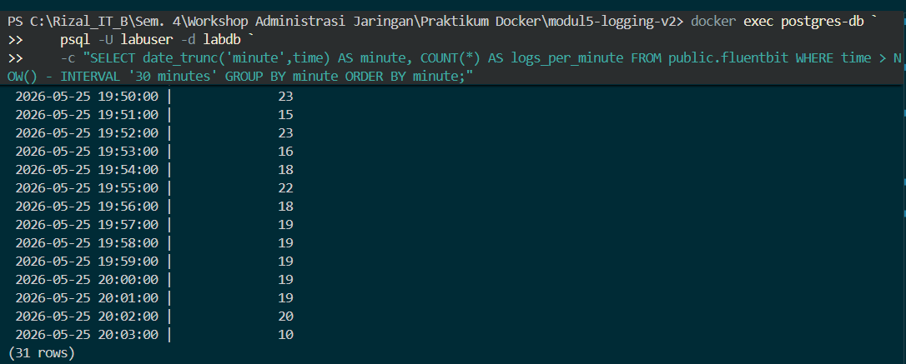

# curl /api/logs/stats — response JSON 
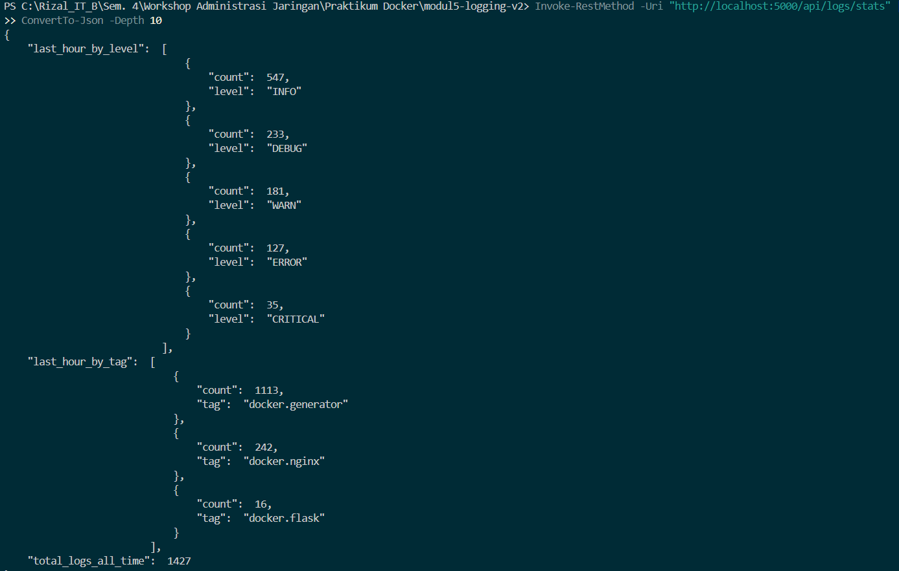

# curl /api/logs/search?q=error — response JSON

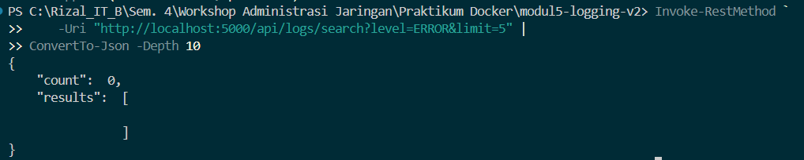

=

# Pertanyaan Post-Lab

1.  Berapa total log yang masuk ke PostgreSQL setelah 5 menit? Tunjukkan
    distribusi per tag dan per level.

> 
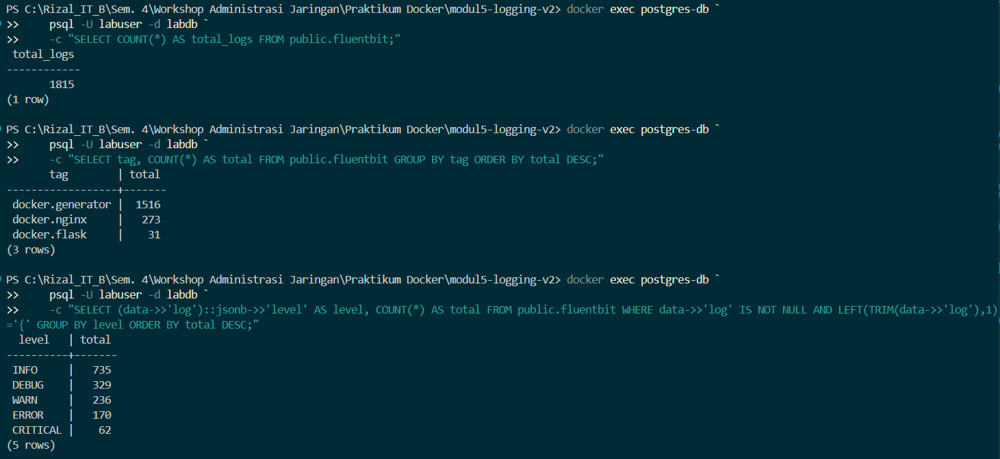

2.  Tulis query SQL yang menampilkan log rate per menit selama 10 menit
    terakhir. Tunjukkan hasilnya.

> query SQL:
>
> SELECT
>
> date_trunc('minute', time) AS minute,
>
> COUNT(\*) AS logs_per_minute
>
> FROM public.fluentbit
>
> WHERE time \> NOW() - INTERVAL '10 minutes'
>
> GROUP BY minute
>
> ORDER BY minute;
>
> 
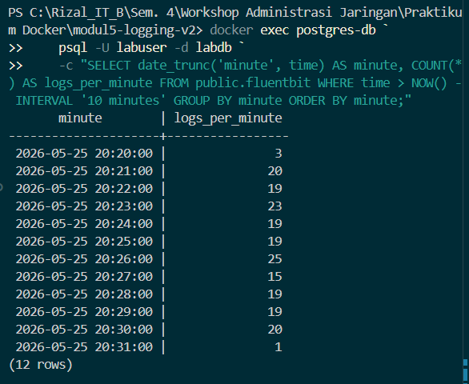

3.  Apa yang terjadi jika container fluent-bit di-stop? Apakah container
    lain juga stop? Apakah log yang dihasilkan selama Fluent Bit down
    hilang?
    
    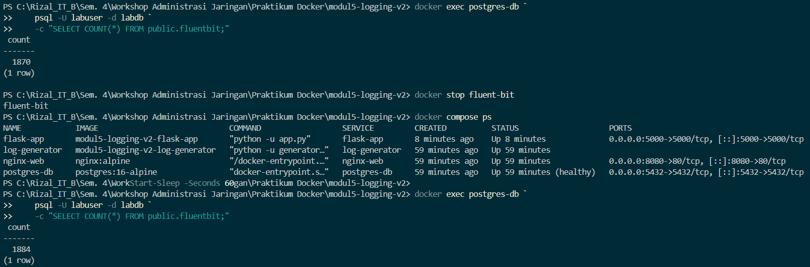

> Log tetap, sehingga disimpulkan bahwa log tidak masuk selama Fluent
> Bit mati.

4.  Jelaskan alur sebuah log entry dari log-generator stdout sampai bisa
    di-query di PostgreSQL. Sebutkan setiap komponen yang dilalui.

> log-generator
>
> │
>
> ▼
>
> stdout
>
> │
>
> ▼
>
> Docker Fluentd Logging Driver
>
> │
>
> ▼
>
> Fluent Bit (Forward Input)
>
> │
>
> ▼
>
> Fluent Bit PostgreSQL Output
>
> │
>
> ▼
>
> PostgreSQL (public.fluentbit)
>
> │
>
> ▼
>
> Flask API / Query SQL
>
> Komponen yang dilalui:

1.  Log Generator

2.  stdout

3.  Docker Fluentd Driver

4.  Fluent Bit

5.  PostgreSQL

6.  Flask API atau SQL Client

<!-- -->

5.  Jelaskan perbedaan antara log Nginx (plain text) dan log generator
    (structured JSON) saat tersimpan di kolom data JSONB. Mengapa view
    structured_logs hanya menampilkan log JSON?

### Kesimpulan
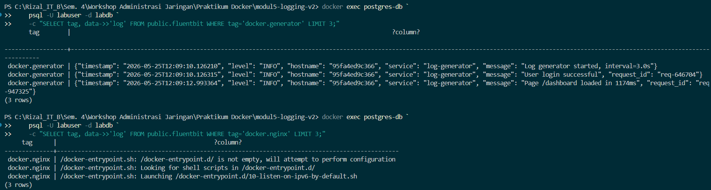

- Log Generator menghasilkan structured JSON sehingga dapat diparsing
  menjadi field level, message, service, dan hostname.

- Log Nginx menghasilkan plain text sehingga tidak memiliki struktur
  JSON.

- View structured_logs hanya menampilkan log yang dapat diubah menjadi
  JSON karena query view menggunakan parsing JSON terhadap field
  data-\>\>'log'.
