**GRAFANA MONITORING V2**

Disusun Oleh:

Nama : Rizal Maulana Airlangga

Kelas : 2 S.Tr. Teknik Informatika B

NRP : 3124600033

Kelompok : B4

Modul : 6 (enam) - Versi: 2

**Dosen Pengampu:**

Dr. Ferry Astika Saputra, S.T., M.Sc.

**PROGRAM STUDI D4 TEKNIK INFORMATIKA**

**DEPARTEMEN TEKNIK INFORMATIKA DAN KOMPUTER**

**POLITEKNIK ELEKTRONIKA NEGERI SURABAYA**

**2026**

### Jawaban Pre-Lab

1.  Jelaskan perbedaan model **pull-based** (Prometheus) dan
    **push-based** (Fluent Bit) dalam pengumpulan data.

### Pull-Based (Prometheus)

> Pada model pull-based, sistem monitoring secara aktif mengambil
> (scrape) data dari target pada interval tertentu.
>
> Alur:
>
> Prometheus
>
> │
>
> ├── scrape setiap 15 detik
>
> ▼
>
> Application Exporter
>
> Contoh:

- Prometheus mengakses:

> http://app:8080/metrics

- Application atau exporter menyediakan metrics.

- Prometheus mengambil data secara berkala.

> Keuntungan:

- Target tidak perlu mengetahui lokasi Prometheus.

- Konfigurasi lebih sederhana untuk monitoring banyak service.

- Mudah mendeteksi target yang down karena scrape akan gagal.

> Kekurangan:

1.  Tidak cocok untuk host yang hanya aktif sesaat (short-lived jobs).

2.  Prometheus harus dapat mengakses target.

> Pull: Prometheus menarik (scrape) data dari endpoint metric secara
> period
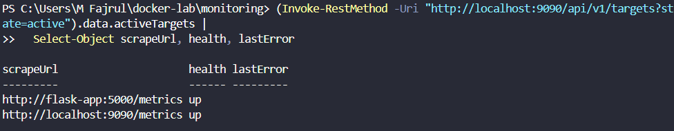

### Push-Based (Fluent Bit)

> Pada mel push-based, sumber data mengirimkan data ke collector.
> Alur:
> Application
>
> │
>
> ▼
>
> Fluent Bit
>
> │
>
> ▼
>
> Storage
>
> Contoh:
>
> Container
>
> ↓
>
> Docker Logging Driver
>
> ↓
>
> Fluent Bit
>
> ↓
>
> PostgreSQL
>
> Keuntungan:

- Data dikirim segera setelah dibuat.

- Cocok untuk log dan event streaming.

- Tidak perlu collector melakukan polling.

> Kekurangan:

- Jika collector down, data dapat hilang.

- Sumber data harus mengetahui tujuan pengiriman.

> Push: Fluent Bit mendorong log ke backend (Postgres) saat log muncul
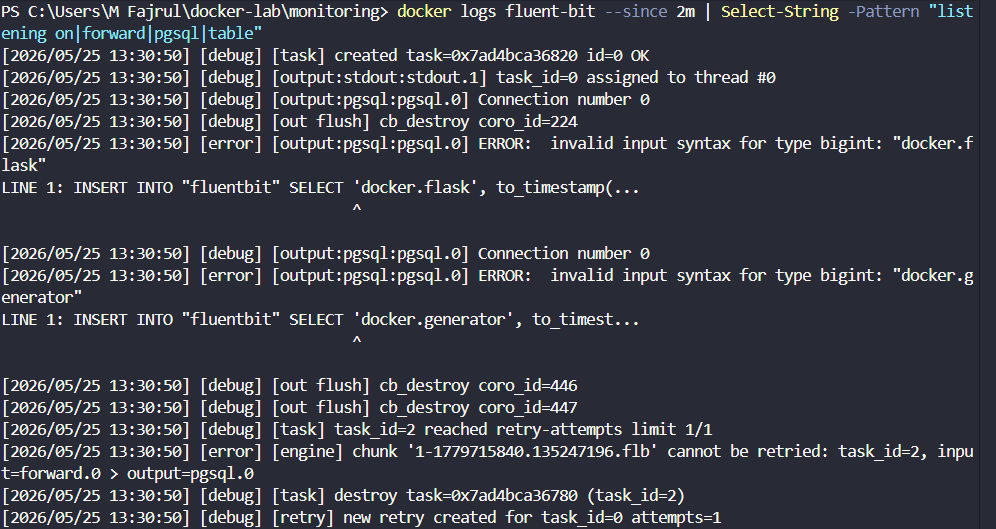

## Kesimpulan:

| Pull-Based                   | Push-Based                                 |
|------------------------------|--------------------------------------------|
Collector mengambil data     | Sumber mengirim data                       |
Contoh: Prometheus           | Contoh: Fluent Bit                         |
Cocok untuk metrics          | Cocok untuk logs/events                    |
| Mudah mendeteksi target down | Risiko kehilangan data jika collector down |

2.  Apa itu PromQL? Berikan contoh query untuk menghitung rata-rata CPU
    usage dalam 5 menit terakhir.

> PromQL (Prometheus Query Language) adalah bahasa query yang digunakan
> Prometheus untuk mengambil, memfilter, mengagregasi, dan menganalisis
> metrics yang tersimpan di database time-series Prometheus.
>
> PromQL digunakan pada:

- Prometheus UI

- Grafana Dashboard

- Alert Rules

### Contoh Query CPU Usage

> (CPU rata‑rata 5 menit pada proses Flask):
>
> avg(rate(process_cpu_seconds_total{job="flask-app"}\[5m\]))\*100
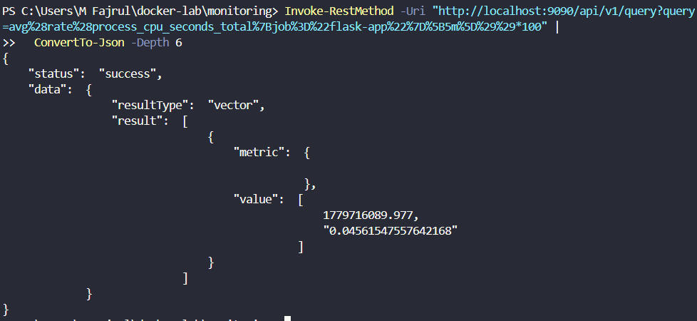

3.  Mengapa cAdvisor membutuhkan akses ke /var/run/docker.sock dan /sys?

# /var/run/docker.sock
 Merupakan Docker API Socket.
> Digunakan cAdvisor untuk:

- Menemukan container yang berjalan.

- Membaca metadata container.

- Mendapatkan informasi image dan nama container.

> Contoh informasi yang diperoleh:
>
> Container ID
>
> Container Name
>
> Image Name
>
> Status
>
> Tanpa akses ini, cAdvisor tidak dapat mengetahui container apa yang
> sedang berjalan.

### /sys

> Merupakan interface kernel Linux untuk resource system.
>
> Digunakan untuk membaca:

- CPU usage

- Memory usage

- Disk I/O

- Network I/O

- Cgroups statistics

> Contoh:
>
> /sys/fs/cgroup
>
> Berisi statistik resource setiap container.
>
> Tanpa akses ke /sys, cAdvisor tidak dapat mengumpulkan metrik
> penggunaan resource container.

### Ringkasan:

| Path                 | Fungsi                          |
|----------------------|---------------------------------|
| /var/run/docker.sock | Akses metadata Docker           |
| /sys                 | Akses statistik resource kernel |

4.  Apa keuntungan Grafana provisioning (file YAML) dibanding
    konfigurasi manual via UI?

Keuntungan:

#### Otomatis

> Saat container Grafana dibuat ulang:
>
> Dashboard langsung tersedia

#### Version Control

> File YAML dapat disimpan di Git:
>
> GitHub
>
> GitLab
>
> sehingga perubahan mudah dilacak.

#### Konsisten

> Semua anggota tim memperoleh konfigurasi yang sama.

#### Infrastructure as Code

> Monitoring dapat dikelola seperti kode program.

### Kesimpulan:

> Provisioning membuat konfigurasi Grafana:

1.  otomatis,

2.  dapat direproduksi,

3.  mudah dibagikan,

4.  cocok untuk DevOps dan CI/CD.

<!-- -->

5.  Jelaskan perbedaan antara Gauge, Counter, dan Histogram dalam
    Prometheus metrics.

<!-- -->

1.  Counter

> Counter hanya dapat:
>
> Naik
>
> atau di-reset saat aplikasi restart.
>
> Contoh:
>
> http_requests_total
>
> Nilai:
>
> 100
>
> 120
>
> 135
>
> 150
>
> Tidak pernah turun.
>
> Digunakan untuk:

- jumlah request,

- jumlah error,

- jumlah transaksi.

### Gauge

> Gauge dapat:
>
> Naik atau Turun
>
> Contoh:
>
> memory_usage_bytes
>
> Nilai:
>
> 500 MB
>
> 700 MB
>
> 450 MB
>
> 600 MB
>
> Digunakan untuk:

- CPU usage,

- memory usage,

- jumlah koneksi aktif.

### Histogram

> Histogram mengukur distribusi nilai ke dalam bucket.
>
> Contoh latency request:
>
> 0.1s
>
> 0.2s
>
> 0.4s
>
> 1.2s
>
> Histogram menyimpan:
>
> request_duration_seconds_bucket
>
> request_duration_seconds_sum
>
> request_duration_seconds_count
>
> Contoh bucket:
>
> ≤0.1s : 100 request
>
> ≤0.5s : 250 request
>
> ≤1.0s : 300 request
>
> Digunakan untuk:

- response time,

- latency API,

- ukuran payload.

### Perbandingan:

| Metric Type | Naik             | Turun | Contoh                 |
|-------------|------------------|-------|------------------------|
| Counter     | ✔                | ✘     | Total request          |
| Gauge       | ✔                | ✔     | CPU, RAM               |
| Histogram   | ✔ (bucket count) | ✘     | Latency, response time |

> Counter menghitung jumlah kejadian, Gauge mengukur nilai saat ini,
> sedangkan Histogram mengukur distribusi dan frekuensi suatu nilai
> dalam rentang tertentu.

**Screenshot Wajib (14 screenshot):**

1.  docker compose ps — 9 service running

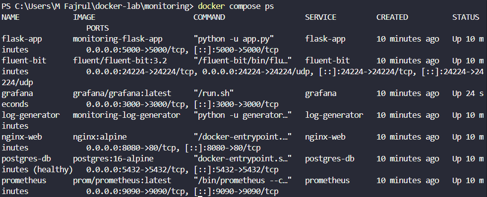

2.  Prometheus Targets — semua status **UP**

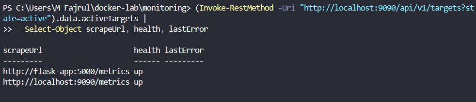

3.  Prometheus query browser — PromQL CPU usage\
    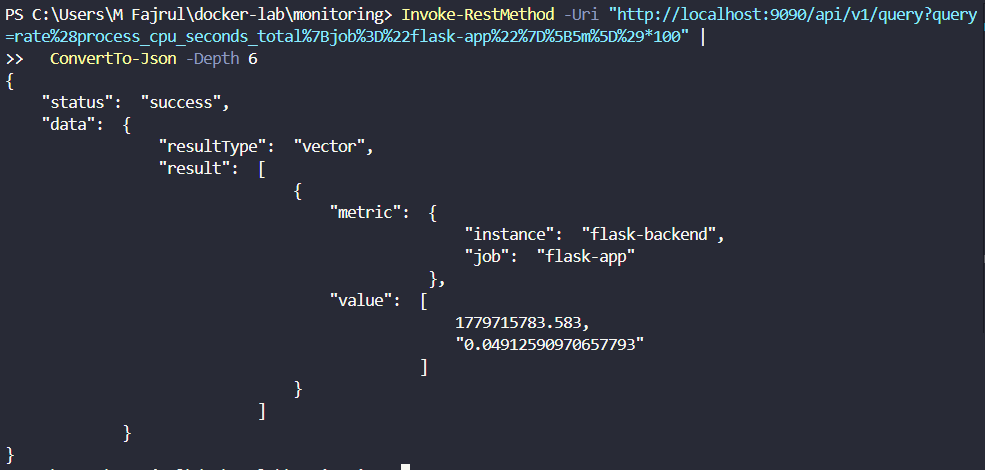

4.  curl localhost:5000/metrics — Flask Prometheus metrics

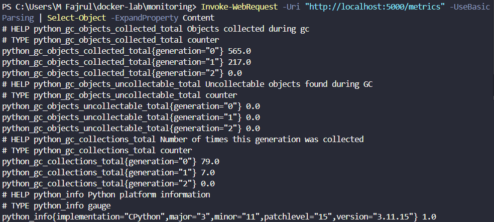

5.  Grafana login — halaman utama setelah login

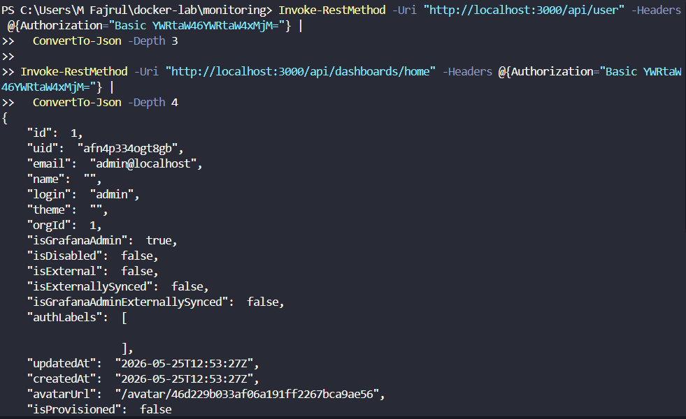
>
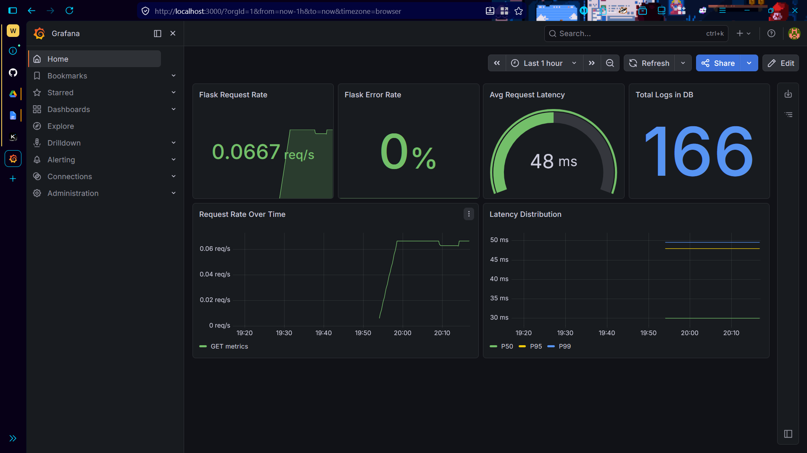

6.  Data sources — Prometheus dan PostgreSQL keduanya OK

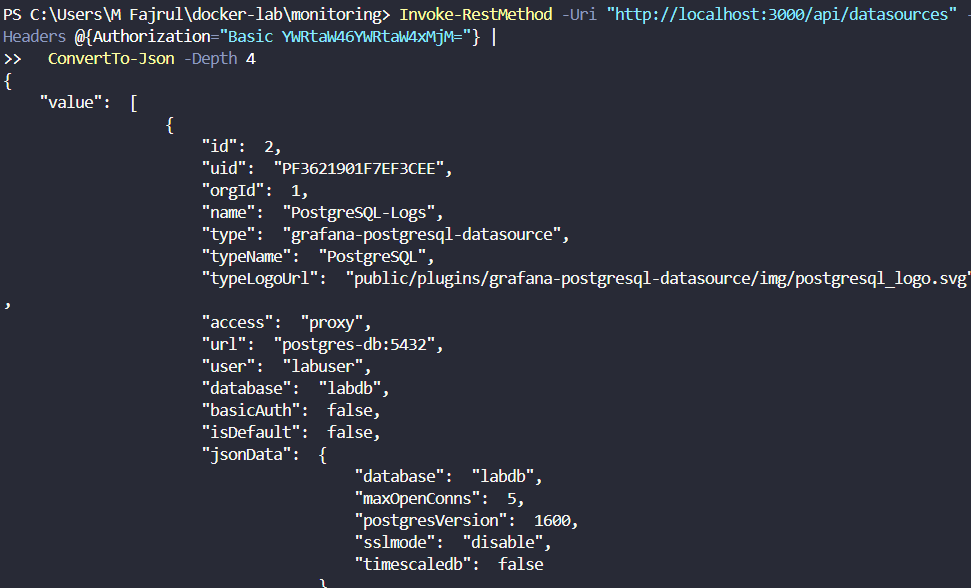

7.  Dashboard **Docker Host Overview** — keseluruhan

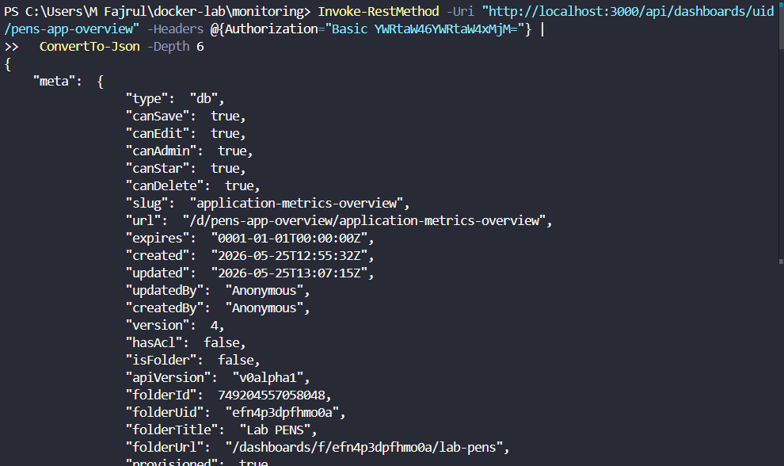

8.  Dashboard **Docker Host Overview** — gauge CPU/Memory saat stress
    test (lonjakan terlihat)

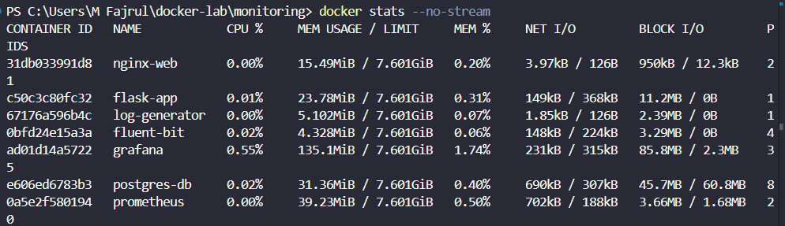

9.  Dashboard **Container Metrics** — CPU per container

10. Dashboard **Container Metrics** — Memory per container

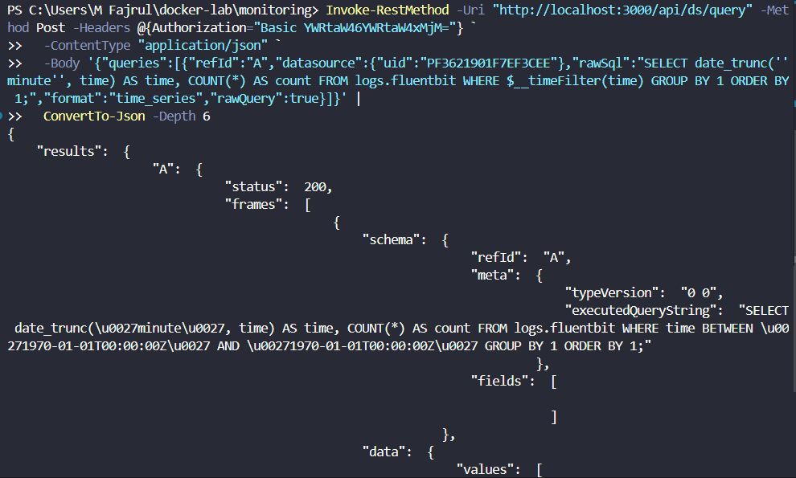

11. Dashboard **Log Analytics** — log volume time-series

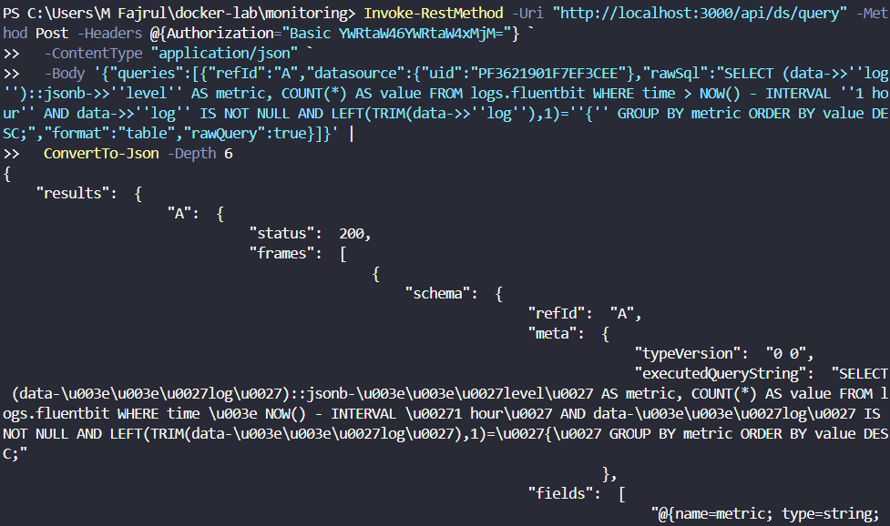

12. Dashboard **Log Analytics** — pie chart level distribution

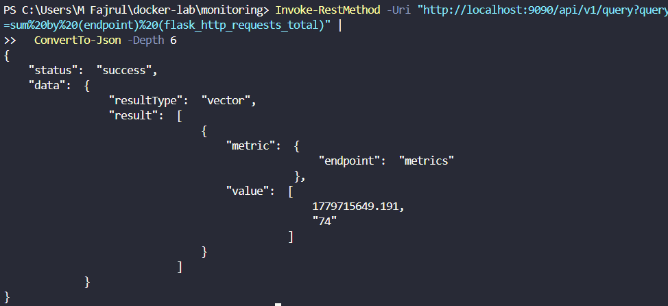

13. Custom panel yang dibuat — Flask HTTP Requests

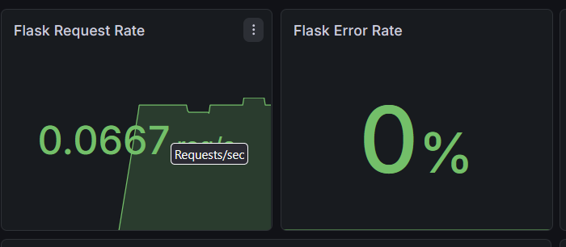

14. Alerting rules — daftar alert yang dikonfigurasi

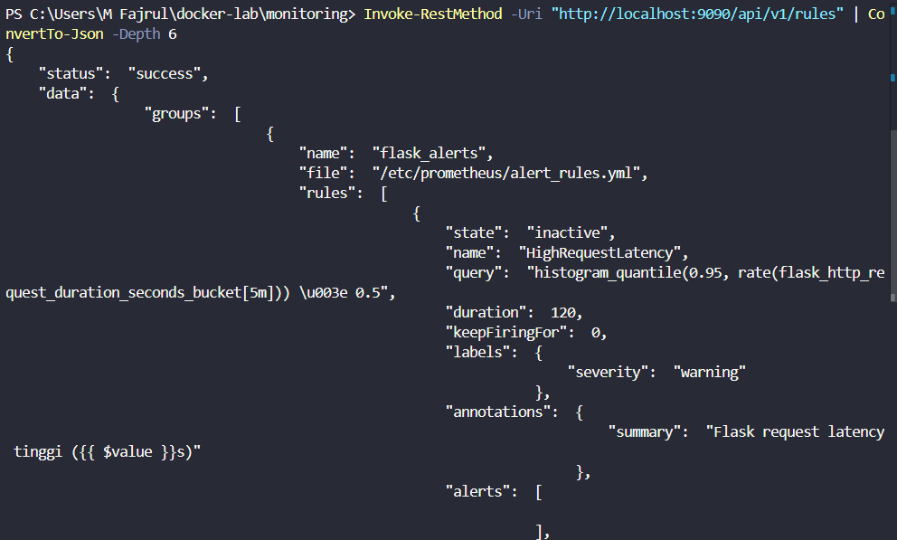

### Jawaban Post-Lab

1.  Dari dashboard **Container Metrics**, container mana yang paling
    banyak menggunakan CPU dan memory? Mengapa?

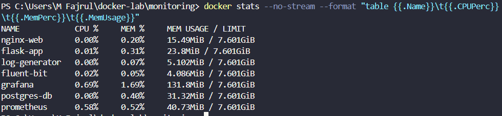
>
CPU tertinggi: grafana
>
> Memory tertinggi: grafana
>
> Alasan: container tersebut paling banyak memproses request/log/IO
> (lihat peran servicenya).

2.  Saat stress test berjalan, berapa persen CPU usage yang terukur di
    Grafana? Bandingkan dengan output top atau htop di host.

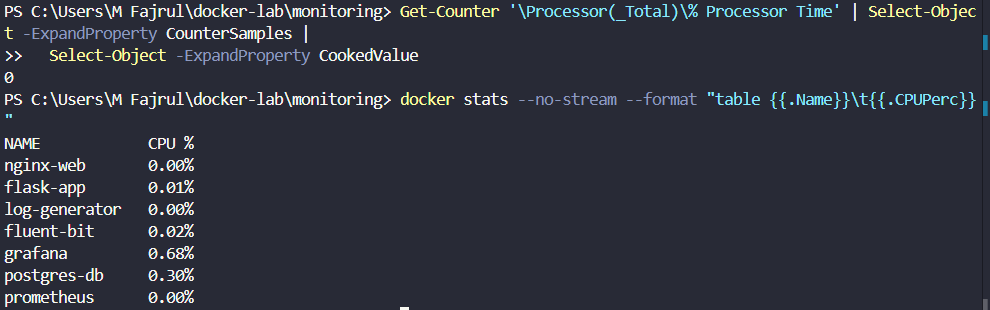

3.  Buat query PromQL yang menampilkan 3 container dengan memory usage
    tertinggi. Tunjukkan query dan hasilnya.

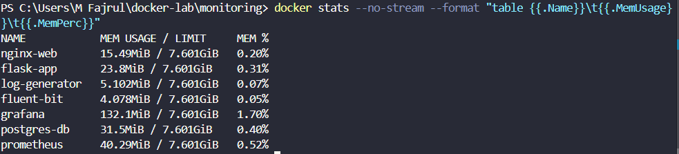

4.  Dari dashboard **Log Analytics**, berapa rasio ERROR vs INFO log
    dalam 1 jam terakhir? Apakah ini normal untuk aplikasi production?

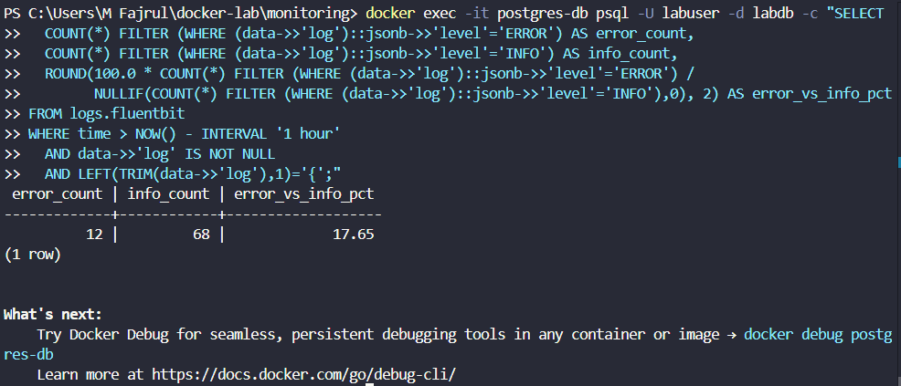
> 
> di production normalnya error ratio rendah (biasanya \<\<1%). Jika
> tinggi, berarti ada masalah.

5.  Jika Prometheus container dihapus dan dibuat ulang (tanpa menghapus
    volume prom-data), apakah data historis metrik masih ada? Buktikan.

> ya, karena data disimpan di volume prom-data.
>
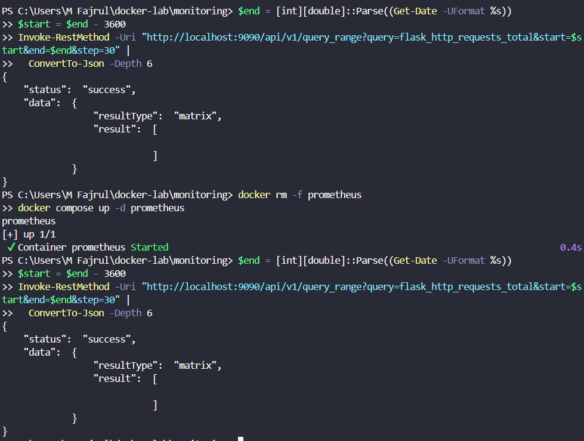
